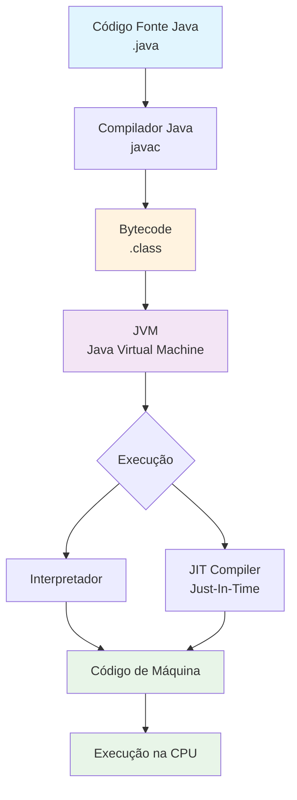

# Notas - Aula 1

Hello World

```java

public class Main {

    public static void main(String[] args) {
        System.out.println("Hello World");
    }
}
```

Classe precisa ter o mesmo nome do arquivo.

## Fluxograma: Java para Código de Máquina JVM



## JVM - Máquina Virtual Java

A **JVM (Java Virtual Machine)** é o componente que torna possível a frase famosa:

### "Write Once, Run Anywhere" (Escreva uma vez, execute em qualquer lugar)

**Por que isso funciona?**

1. **Independência de Plataforma**: O código Java é compilado para **bytecode** (.class), não para código de máquina nativo
2. **JVM como Tradutor**: Cada sistema operacional tem sua própria implementação da JVM
3. **Abstração de Hardware**: A JVM abstrai as diferenças entre sistemas Windows, Linux, macOS, etc.

**Exemplo Prático:**
```
Código Java (.java)
        ↓
Compilador (javac)
        ↓
Bytecode (.class) ← Este arquivo é UNIVERSAL
        ↓
JVM Windows → Executa no Windows
JVM Linux → Executa no Linux  
JVM macOS → Executa no macOS
```

**Vantagens:**
- ✅ Não precisa recompilar para cada sistema
- ✅ Código portável entre diferentes plataformas
- ✅ Facilita distribuição de aplicações
- ✅ Manutenção mais simples (um código para todos)

**Diferença de outras linguagens:**
- C/C++: Compila diretamente para código de máquina (específico do sistema)
- Java: Compila para bytecode (universal), depois a JVM converte para código de máquina

## JRE vs JDK

### Diferença Principal

| Componente | O que é | Inclui |
|------------|---------|--------|
| **JRE** (Java Runtime Environment) | Ambiente para **executar** aplicações Java | JVM + Bibliotecas básicas |
| **JDK** (Java Development Kit) | Kit para **desenvolver** aplicações Java | JRE + Compilador (javac) + Ferramentas |

### Composição Detalhada

**JRE (Java Runtime Environment):**
- ✅ JVM (Máquina Virtual Java)
- ✅ Bibliotecas de classe (java.lang, java.util, etc.)
- ✅ Arquivos de configuração
- ❌ Compilador (javac)
- ❌ Ferramentas de desenvolvimento

**JDK (Java Development Kit):**
- ✅ **Tudo do JRE**
- ✅ Compilador (javac)
- ✅ Ferramentas de desenvolvimento (javadoc, jdb, etc.)
- ✅ Bibliotecas adicionais

### Ferramentas Incluídas

**Ferramentas do JRE:**

| Ferramenta | Função |
|------------|--------|
| `java` | Lançador de aplicações Java |
| `javaw` | Lançador de aplicações Java (sem janela de console) |
| `keytool` | Gerenciamento de certificados e keystores |
| `policytool` | Editor gráfico de políticas de segurança |
| `orbd` | Daemon do Object Request Broker (CORBA) |
| `servertool` | Ferramenta para servidor Java IDL |
| `tnameserv` | Serviço de nomes Java IDL |
| `kinit` | Gerenciador de tickets Kerberos |
| `klist` | Visualizador de keytab Kerberos |
| `ktab` | Gerenciador de tabelas de chaves Kerberos |

**Ferramentas do JDK (além das do JRE):**

| Ferramenta | Função |
|------------|--------|
| `javac` | Compilador Java |
| `javadoc` | Gerador de documentação HTML |
| `jar` | Ferramenta para criar e manipular arquivos JAR |
| `javap` | Disassemblador de classes Java |
| `jdb` | Depurador Java |
| `jconsole` | Console de monitoramento e gerenciamento |
| `jvisualvm` | Ferramenta de profiling visual |
| `jmap` | Ferramenta de mapeamento de memória |
| `jhat` | Analisador de heap Java |
| `jstack` | Ferramenta de rastreamento de pilha |
| `jstat` | Monitor de estatísticas Java |
| `jps` | Status de processos Java |
| `native2ascii` | Conversor de caracteres nativos para ASCII |
| `serialver` | Gerador de serialVersionUID |
| `xjc` | Compilador de esquemas XML para classes Java |
| `schemagen` | Gerador de esquemas XML a partir de classes |
| `wsgen` | Gerador de artefatos JAX-WS |
| `wsimport` | Importador de serviços web JAX-WS |

### Onde Usar

**JRE:**
- 🖥️ **Computadores de usuários finais** para executar programas Java
- 🖥️ **Servidores de produção** que apenas rodam aplicações Java
- 📱 **Qualquer máquina** que precisa executar .jar ou applets Java

**JDK:**
- 💻 **Computadores de desenvolvedores** para criar e compilar código Java
- 💻 **Ambientes de desenvolvimento** (IDEs, máquinas de build)
- 💻 **Servidores de CI/CD** que precisam compilar código Java

### Quem Usa

**JRE:**
- 👤 **Usuários finais** que querem executar programas Java
- 👤 **Administradores de sistema** configurando servidores de produção
- 👤 **Qualquer pessoa** que precisa apenas **rodar** aplicações Java

**JDK:**
- 👨‍💻 **Desenvolvedores Java** que escrevem código
- 👨‍💻 **Engenheiros de build** configurando pipelines
- 👨‍💻 **DevOps** que precisam compilar aplicações

### Exemplo Prático

```
Situação: Quero jogar um jogo em Java
→ Preciso do: JRE ✅ (apenas executar)

Situação: Quero criar um jogo em Java  
→ Preciso do: JDK ✅ (desenvolver + executar)

Situação: Servidor que roda aplicação Java em produção
→ Preciso do: JRE ✅ (apenas executar)

Situação: Máquina que compila aplicação Java
→ Preciso do: JDK ✅ (desenvolver + executar)
```

### Resumo Simples

- **JRE** = Motor para rodar Java (como um player de música)
- **JDK** = Estúdio completo para criar e rodar Java (como um estúdio de gravação)

## Compilação Ahead-of-Time (AOT) e GraalVM

### O que é Compilação Ahead-of-Time (AOT)?

**Ahead-of-Time Compilation** é o processo de compilar código Java **diretamente para código de máquina nativo** antes da execução, ao contrário da compilação Just-In-Time (JIT) que ocorre durante a execução.

```
Compilação Tradicional (JIT):
Código Java → Bytecode → JVM → JIT → Código de Máquina (em tempo de execução)

Compilação AOT:
Código Java → Bytecode → AOT Compiler → Código de Máquina (antes da execução)
```

### Vantagens da Compilação AOT

| Vantagem | Descrição |
|----------|-----------|
| **Inicialização mais rápida** | Código já está em formato nativo, sem necessidade de compilação JIT |
| **Menor uso de memória** | Não precisa armazenar bytecode e metadados JIT |
| **Melhor para containers** | Imagens Docker menores e mais rápidas |
| **Ideal para serverless** | Funções iniciam mais rápido |
| **Previsibilidade** | Desempenho consistente desde o início |

### GraalVM - A Revolução na Compilação Java

**GraalVM** é uma máquina virtual de alto desenvolvimento criada pela Oracle que suporta compilação AOT nativa para Java.

#### Características do GraalVM

```
GraalVM
├── VM de alta performance
├── Compilador AOT nativo
├── Suporte a múltiplas linguagens
│   ├── Java
│   ├── JavaScript
│   ├── Python
│   ├── Ruby
│   ├── R
│   ├── C/C++
│   └── LLVM
└── GraalVM Native Image
    └── Compilação AOT para executáveis nativos
```

#### GraalVM Native Image

O **Native Image** é a funcionalidade principal do GraalVM que permite compilar aplicações Java em **executáveis nativos** standalone.

**Processo de compilação com Native Image:**
```
Código Java (.java)
        ↓
Compilador Java (javac)
        ↓
Bytecode (.class)
        ↓
GraalVM Native Image
        ↓
Executável Nativo (binário)
        ↓
Execução direta (sem JVM)
```

#### Comparação: JVM Tradicional vs GraalVM Native Image

| Característica | JVM Tradicional | GraalVM Native Image |
|----------------|-----------------|----------------------|
| **Inicialização** | Lenta (segundos) | Rápida (milissegundos) |
| **Uso de memória** | Alto | Baixo |
| **Tamanho** | Precisa de JVM | Executável standalone |
| **Warm-up** | Necessário | Não necessário |
| **Portabilidade** | Alta (qualquer OS com JVM) | Limitada (compilar para cada OS) |
| **Otimização JIT** | Sim (em tempo de execução) | Não (compilado antecipadamente) |

#### Quando Usar Cada Abordagem

**JVM Tradicional (JIT):**
- ✅ Aplicações de longa duração (servidores)
- ✅ Onde o warm-up não é crítico
- ✅ Aplicações que precisam de máxima performance após warm-up
- ✅ Quando a portabilidade é essencial

**GraalVM Native Image (AOT):**
- ✅ Microsserviços e serverless
- ✅ Aplicações CLI
- ✅ Containers Docker
- ✅ Quando inicialização rápida é crítica
- ✅ Aplicações de curta duração

#### Exemplo Prático

```
Cenário: Microsserviço em Kubernetes

Sem GraalVM:
- Imagem Docker: ~200MB (com JVM)
- Tempo de inicialização: 3-5 segundos
- Uso de memória: ~256MB

Com GraalVM Native Image:
- Imagem Docker: ~50MB (executável nativo)
- Tempo de inicialização: ~100ms
- Uso de memória: ~64MB
```

#### Comandos GraalVM Básicos

```bash
# Compilar aplicação Java para bytecode
javac MyApp.java

# Compilar para executável nativo com GraalVM
native-image MyApp

# Executar aplicação nativa
./myapp

# Comparar com execução tradicional
java MyApp
```

### Resumo da Evolução

```
Java Compilation Evolution:

1. Bytecode + JVM (1995)
   - "Write Once, Run Anywhere"
   - Interpretação + JIT

2. JIT Compilation
   - Otimização em tempo de execução
   - Warm-up necessário

3. AOT Compilation (GraalVM)
   - Compilação antecipada
   - Inicialização rápida
   - Executáveis nativos

4. Futuro: GraalVM + AOT + JIT
   - Combinação de abordagens
   - Melhor dos dois mundos
```

