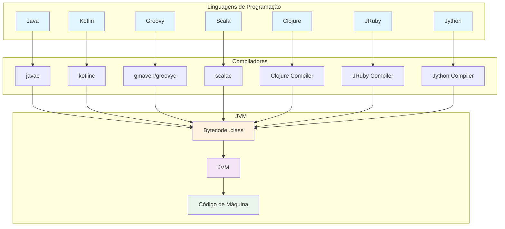

# Notas - Aula 2

## Múltiplas Linguagens na JVM

Uma das grandes vantagens da **JVM (Java Virtual Machine)** é que ela não é limitada apenas à linguagem Java. Diversas outras linguagens podem ser compiladas para **bytecode** e executadas na JVM.

### O que isso significa?

Qualquer linguagem que compile para **bytecode Java** (.class) pode ser executada na JVM. Isso permite que desenvolvedores escolham a linguagem mais adequada para cada projeto, aproveitando todo o ecossistema Java.

```
Linguagem → Compilador → Bytecode → JVM → Execução
```

### Fluxograma: Múltiplas Linguagens para JVM



### Principais Linguagens JVM

#### 1. Java
- **Compilador**: javac
- **Características**: Linguagem oficial, orientada a objetos, fortemente tipada
- **Uso**: Aplicações empresariais, Android, sistemas distribuídos

**Exemplo:**
```java
public class Hello {
    public static void main(String[] args) {
        System.out.println("Hello World");
    }
}
```

#### 2. Kotlin
- **Compilador**: kotlinc
- **Características**: Moderna, concisa, interoperável com Java, oficial para Android
- **Uso**: Desenvolvimento Android, servidores, multiplataforma

**Exemplo:**
```kotlin
fun main() {
    println("Hello World")
}
```

#### 3. Groovy
- **Compilador**: groovyc / gmaven
- **Características**: Dinâmica, script-friendly, integração com Java
- **Uso**: Scripts, build automation (Gradle), testes

**Exemplo:**
```groovy
println "Hello World"
```

#### 4. Scala
- **Compilador**: scalac
- **Características**: Funcional + OOP, concisa, imutável por padrão
- **Uso**: Big Data (Spark), sistemas distribuídos, aplicações financeiras

**Exemplo:**
```scala
object Hello extends App {
  println("Hello World")
}
```

#### 5. Clojure
- **Compilador**: Clojure Compiler
- **Características**: LISP funcional, imutável, concorrência robusta
- **Uso**: Sistemas concorrentes, processamento de dados, REPL-driven development

**Exemplo:**
```clojure
(println "Hello World")
```

#### 6. JRuby
- **Compilador**: JRuby Compiler
- **Características**: Ruby na JVM, dinâmica, metaprogramação
- **Uso**: Web (Rails), scripts, automação

**Exemplo:**
```ruby
puts "Hello World"
```

#### 7. Jython
- **Compilador**: Jython Compiler
- **Características**: Python na JVM, dinâmica, fácil de aprender
- **Uso**: Scripts, prototipagem, integração com Java

**Exemplo:**
```python
print("Hello World")
```

### Comparação das Linguagens

| Linguagem | Paradigma | Tipagem | Verbosidade | Compilação |
|-----------|-----------|---------|-------------|------------|
| **Java** | OOP | Forte | Alta | Direta para bytecode |
| **Kotlin** | OOP + Funcional | Forte | Baixa | Direta para bytecode |
| **Groovy** | OOP + Dinâmica | Dinâmica/Forte | Muito Baixa | Direta para bytecode |
| **Scala** | OOP + Funcional | Forte | Baixa | Direta para bytecode |
| **Clojure** | Funcional | Dinâmica | Baixa | Direta para bytecode |
| **JRuby** | OOP + Dinâmica | Dinâmica | Baixa | Direta para bytecode |
| **Jython** | OOP + Dinâmica | Dinâmica | Baixa | Direta para bytecode |

### Vantagens de Múltiplas Linguagens na JVM

#### 1. **Interoperabilidade Total**
```
Kotlin → Chama código Java → Chama código Groovy
```
Todas as linguagens podem se comunicar entre si e usar bibliotecas Java.

#### 2. **Reutilização de Ecossistema**
- Todas aproveitam as bibliotecas Java (Maven, frameworks, etc.)
- Mesma JVM, mesmo garbage collector, mesma performance base

#### 3. **Flexibilidade de Escolha**
- **Java**: Para projetos tradicionais e enterprise
- **Kotlin**: Para Android e código mais conciso
- **Groovy**: Para scripts e build automation
- **Scala**: Para big data e programação funcional

#### 4. **Migração Gradual**
```
Projeto Java legado
    ↓
Adicionar módulos em Kotlin
    ↓
Conviver pacificamente com Java
```

### Compilação Cruzada

#### Como compilar diferentes linguagens para bytecode?

**Java:**
```bash
javac Hello.java
java Hello
```

**Kotlin:**
```bash
kotlinc Hello.kt -include-runtime -d Hello.jar
java -jar Hello.jar
```

**Groovy:**
```bash
groovyc Hello.groovy
java Hello
```

**Scala:**
```bash
scalac Hello.scala
scala Hello
```

### Exemplo Prático: Interoperabilidade

#### Arquivo Java (Calculator.java):
```java
public class Calculator {
    public static int add(int a, int b) {
        return a + b;
    }
}
```

#### Arquivo Kotlin (Main.kt):
```kotlin
fun main() {
    val result = Calculator.add(5, 3)  // Chamando código Java
    println("Result: $result")
}
```

#### Compilação e Execução:
```bash
# Compilar Java
javac Calculator.java

# Compilar Kotlin (inclui classes Java)
kotlinc Main.kt Calculator.class -include-runtime -d app.jar

# Executar
java -jar app.jar
```

### Resumo

A JVM é uma plataforma **poliglota** que suporta diversas linguagens de programação. Todas elas:

✅ Compilam para **bytecode** (.class)
✅ São executadas na **mesma JVM**
✅ Podem **interoperar** entre si
✅ Compartilham o **mesmo ecossistema** Java
✅ Aproveitam a **mesma performance** base da JVM

Isso torna a JVM uma das plataformas mais versáteis e poderosas do mundo da programação!