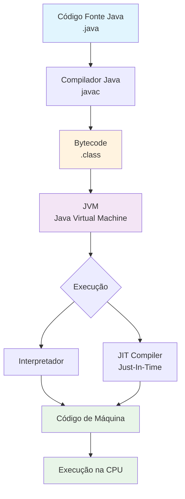

# Notas - Aula 1

Hello World

```java

public class Main {

    public static void main(String[] args) {
        System.out.println("Hello World");
    }
}
```

Classe precisa ter o mesmo nome do arquivo.

## Fluxograma: Java para Código de Máquina JVM



