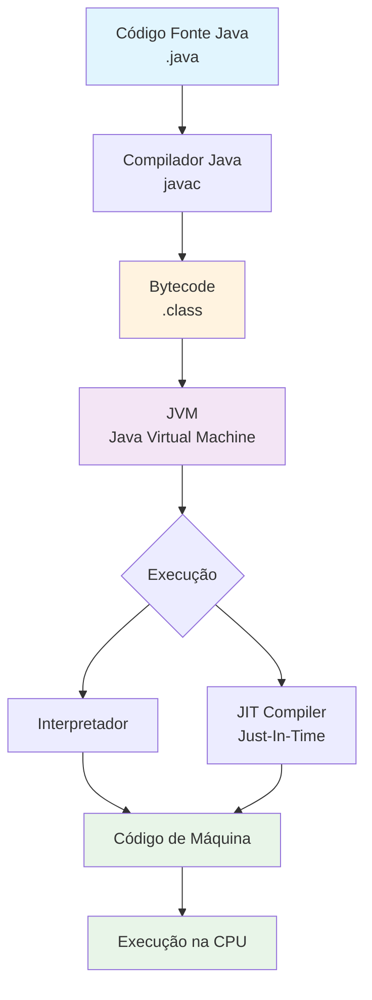

# Notas - Aula 1

Hello World

```java

public class Main {

    public static void main(String[] args) {
        System.out.println("Hello World");
    }
}
```

Classe precisa ter o mesmo nome do arquivo.

## Fluxograma: Java para Código de Máquina JVM



## JVM - Máquina Virtual Java

A **JVM (Java Virtual Machine)** é o componente que torna possível a frase famosa:

### "Write Once, Run Anywhere" (Escreva uma vez, execute em qualquer lugar)

**Por que isso funciona?**

1. **Independência de Plataforma**: O código Java é compilado para **bytecode** (.class), não para código de máquina nativo
2. **JVM como Tradutor**: Cada sistema operacional tem sua própria implementação da JVM
3. **Abstração de Hardware**: A JVM abstrai as diferenças entre sistemas Windows, Linux, macOS, etc.

**Exemplo Prático:**
```
Código Java (.java)
        ↓
Compilador (javac)
        ↓
Bytecode (.class) ← Este arquivo é UNIVERSAL
        ↓
JVM Windows → Executa no Windows
JVM Linux → Executa no Linux  
JVM macOS → Executa no macOS
```

**Vantagens:**
- ✅ Não precisa recompilar para cada sistema
- ✅ Código portável entre diferentes plataformas
- ✅ Facilita distribuição de aplicações
- ✅ Manutenção mais simples (um código para todos)

**Diferença de outras linguagens:**
- C/C++: Compila diretamente para código de máquina (específico do sistema)
- Java: Compila para bytecode (universal), depois a JVM converte para código de máquina

